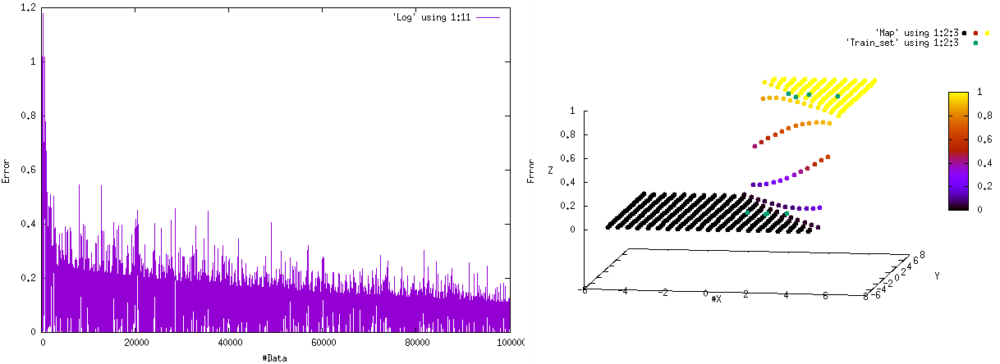
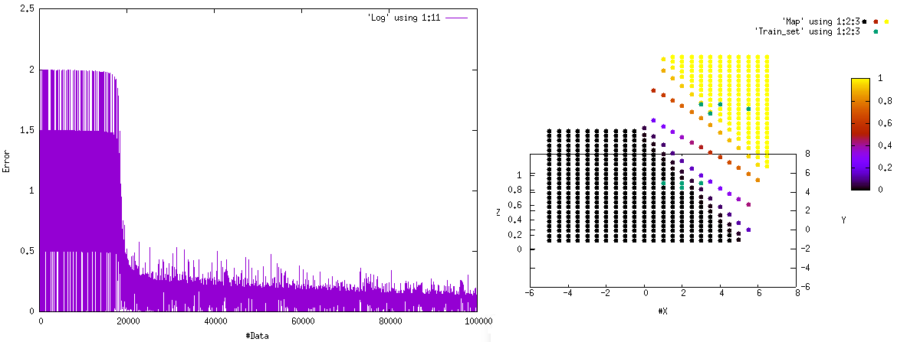
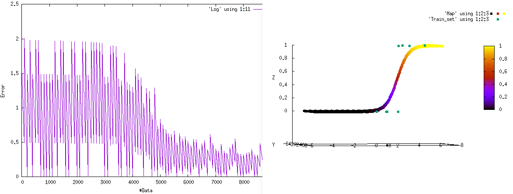

# Neural_Network
C++ implementation of a basic Neural Network

In NN_1_neuron there is a 1 neuron (2 inputs) implementation which uses gnuplot to graph
the total error over the data set and the final results over a 3D plot.

Here are some results (Train set shown in green):

